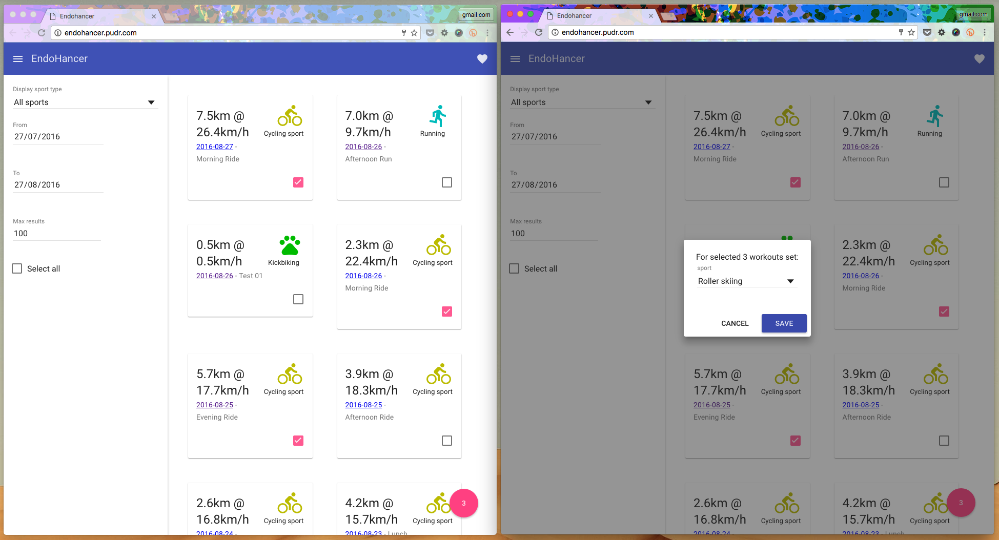

# EndoHancer

On 22.08.2016 Endomondo [added](https://support.endomondo.com/hc/en-us/articles/225992148-Android-App-Update-16-8-1) long awaited sport [kick scooter](http://www.kolobezky-plzen.cz/). Like many of my friends, for a long time I logged my kick scooter activity as [roller skiing](https://en.wikipedia.org/wiki/Roller_skiing). So then I wanted to change all my logged *roller skiing* activity to *kick scooter*. Unfortunately in Endomondo web/mobile there is no option to do so. I also looked at [sport-tracker-liberator library](https://github.com/isoteemu/sports-tracker-liberator), which was great source of resources for this work.

In the end I decided to create little service which is able to **load and massively edit endomondo workout sport types**. There is much higher potential in this service, but until there is a request, I'm not planning to expand it's functionality.

Heroku instance: http://endohancer.pudr.com

## Disclaimer ##

1. Please test the functionality on one workout at first. I'm not responsible if for some reason your whole workout history is wiped out.
1. The service uses your **Endomondo login credentials**.
  1. You should never put those anywhere else than Endomondo site, because you cannot tell if the service is not saving your access credentials.
  1. This approach works for me. If you are not comfortable with that, you should not use this service!
1. There are definitely bugs and missing functionality. Feel free to open an issue / pull-request to improve it.

## Screenshot ##



## Installation

* `git clone https://github.com/MichalBryxi/EndoHancer.git` this repository
* `cd EndoHancer`
* `npm install`
* `bower install`

## Running / Development

* `ember serve --proxy http://api.mobile.endomondo.com/`
* Visit your app at [http://localhost:4200](http://localhost:4200).

## Used technologies / packages

 * [heroku-buildpack-ember-cli](https://github.com/tonycoco/heroku-buildpack-ember-cli) - buildpack for ember-cli & Heroku
 * [ember-cli](https://ember-cli.com/) - v2.6.1
 ```
 # Keep this up-to-date for ember-cli upgrade
 ember install ember-paper
 ember install ember-intl
 ```
